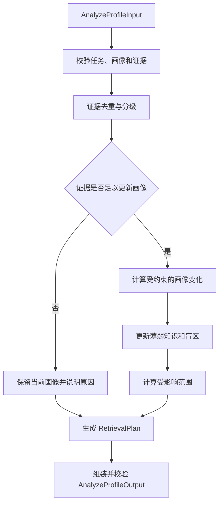

# V2 学情分析智能体内部实现方案

> 文档状态：待实施，知识点评估契约变更已批准  
> 更新日期：2026-07-21  
> 适用领域：`ai_app_dev`（人工智能应用开发实训）  
> 当前阶段：V2 Agent 算法独立开发，不切换生产运行链

## 1. 文档目的

本文档用于指导 Profile Analysis Agent 的 V2 内部算法实现与独立验证。

本阶段交付的是一个能够独立接收 `AnalyzeProfileInput`、完成画像证据判断、画像更新决策和
检索计划生成，并返回 `AnalyzeProfileOutput` 的学情分析智能体。它不是完整多智能体系统的
交付，也不包含 V2 LangGraph、worker、持久化和 SSE 集成。

本阶段完成后，应形成以下可验证链路：

```text
AnalyzeProfileInput
    -> 输入与证据校验
    -> 证据去重和分级
    -> 画像更新门槛判断
    -> 能力与薄弱知识更新
    -> 影响范围计算
    -> RetrievalPlan 生成
    -> AnalyzeProfileOutput
```

## 2. 与项目目标的关系

学情分析智能体位于核心闭环的画像入口和反馈更新环节：

```text
learner profile -> diagnosis -> retrieval -> generation -> review -> decision -> feedback -> update
```

本方案主要支撑以下项目目标：

- 将诊断结果转化为可被生成链消费的五维能力画像和薄弱知识信息。
- 将自然语言反馈、计分测验和验证行为转化为受约束的画像更新或 `no_change` 决策。
- 为检索智能体生成稳定、可解释、可测试的 `RetrievalPlan`。
- 输出画像变化证据、置信度和影响范围，支持 Agent 协作页与学习报告展示。
- 避免单次主观反馈直接覆盖学习者画像。

学情分析智能体不负责检索知识正文、生成教学资源、审核资源事实，也不负责解释原始自然语言
反馈。反馈意图识别由 Tutoring Agent 完成，知识召回由 Knowledge Retrieval Agent 完成。

## 3. 当前基础与问题

### 3.1 已有能力

仓库已经具备以下基础能力：

- V1 `ProfileAnalysisAgent` 和诊断提交流程。
- 选择题自动评分与简答题 rubric 关键词评分。
- 五维能力画像、薄弱知识、前置关系和学习路径生成。
- 画像版本、前一版本、变更维度、证据引用和置信度字段。
- 反馈触发的画像更新基础逻辑。
- 冻结的 V2 `AnalyzeProfileInput`、`ProfileSnapshot`、`EvidenceRef`、
  `AffectedScope`、`RetrievalPlan` 和 `AnalyzeProfileOutput` 契约。

### 3.2 当前限制

现有实现仍有以下限制：

- `profile_agent.py` 使用 V1 `legacy_contracts` 和平铺 State，不是 V2 Agent 边界。
- 简答题主要按 rubric 子串命中评分，不能稳定处理同义表达和部分正确答案。
- `problem_solving`、`knowledge_breadth` 和 `learning_speed` 的部分推导规则解释性不足。
- 单次反馈的固定分值增减没有在算法入口强制执行证据门槛。
- 薄弱知识以错题为主，尚未系统区分 `known`、`partial_mastery`、`confused`、
  `unmastered` 和 `unassessed`。
- 当前生成路径中的画像字段与冻结 V2 `ProfileSnapshot` 字段仍需后续统一适配。
- 缺少画像算法专项案例、稳定指标和 V2 输出契约测试。

## 4. 当前阶段边界

### 4.1 本阶段完成

- 独立的 V2 Profile Analysis Agent。
- 证据去重、证据等级、确认状态和画像更新门槛算法。
- 五维能力与薄弱知识的确定性更新算法。
- 画像版本变更判定和 `AffectedScope` 计算。
- `remedial`、`consolidation`、`challenge` 三种 `RetrievalPlan` 生成。
- 诊断、反馈和不更新分支的单元测试及独立画像算法评测。
- V2 集成准入清单。

### 4.2 本阶段不完成

- 不修改 `build_learning_graph()`、`nodes.py` 和 `generation_worker.py`。
- 不切换当前 V1 生产运行链。
- 不写入 `learner_profiles`、`learning_paths`、`agent_runs` 或 `agent_messages`。
- 不发送 SSE 事件。
- 不修改冻结的 V2 contract、State、Schema、示例和合同测试。
- 不修改当前 V1 `profile_agent.py` 的执行行为。
- 不修改前端页面和 `/api/v1` 公共接口。
- 不在 Profile Analysis Agent 内调用 ChromaDB 或生成教学内容。

上述能力将在所有 V2 Agent 算法完成后的统一集成阶段处理。

## 5. V1 与 V2 隔离策略

本方案采用与 V2 检索智能体相同的迁移策略：V1 保持运行，V2 独立开发，最后统一切换。

```text
backend/app/agents/profile_agent.py
    -> 当前 V1/legacy 实现
    -> 保持生产行为不变

独立 V2 Profile Agent 模块
    -> 只导入 app.agents.contracts
    -> execute(AnalyzeProfileInput) -> AnalyzeProfileOutput
    -> 不读取 V1 State

统一集成阶段
    -> 外部数据构造 V2 Input
    -> V2 Output 写入节点独占 State
    -> worker 负责持久化、消息、SSE 和错误状态
```

本阶段禁止通过仅替换 import 将 `legacy_contracts` 改为 V2 contracts。V1 平铺数据形状与 V2
嵌套契约不同，仅替换类型会产生形式通过、语义错误的实现。

建议新增独立模块，实际文件名可在实现前结合检索智能体最终目录统一确定：

```text
backend/app/agents/profile_agent_v2.py
backend/app/services/profile_analysis_service.py
backend/tests/unit/test_profile_agent_v2.py
backend/tests/unit/test_profile_analysis_service.py
```

如团队统一采用 `backend/app/agents/v2/` 包，则学情分析与检索智能体应一起迁移目录，不单独
形成第三种命名方式。

## 6. V2 契约边界

### 6.1 对外执行边界

V2 Agent 的唯一正式边界为：

```text
execute(AnalyzeProfileInput) -> AnalyzeProfileOutput
```

实现要求：

- 输入后立即执行 Pydantic 校验，不接收任意 `dict[str, Any]` 作为正式边界。
- 输出必须由 `AnalyzeProfileOutput` 构造并完成模型校验。
- `task_id`、`context.task_id` 和输出 `task_id` 必须一致。
- Agent 内部不持有数据库会话、模型客户端、Chroma client 或 LangGraph State。
- 普通日志只记录任务 ID、画像 ID、版本、知识 ID、变更维度、置信度和状态。
- 不记录完整画像、完整反馈文本或完整诊断答案。

### 6.2 输入使用范围

学情分析智能体主要使用：

- `context.trigger_type`：区分首次生成和资源反馈。
- `context.learning_goal`：生成检索查询词并计算目标相关性。
- `context.resource_types`：写入 `RetrievalPlan.resource_types`。
- `current_profile`：当前已持久化或由上游准备的画像快照。
- `diagnostic_summary`：诊断覆盖、总分和已确认诊断证据。
- `feedback_evidence`：Tutoring Agent 输出的脱敏证据。
- `recommended_action`：Tutoring Agent 建议的追问、解释、挑战、复核、重生成或不变。
- `knowledge_assessments`：诊断或计分测验产生的逐知识点评估事实。

### 6.3 结构化知识点评估边界

已批准的 `AnalyzeProfileInput.knowledge_assessments` 提供知识 ID、0-1 可空得分、难度、是否
作答、置信度和关联证据 ID。它不包含原始答案、题目正文、题型或作答时长。
`EvidenceRef.summary` 仍然只是脱敏摘要，不是可供算法解析的数据协议。

因此实现边界固定为：

1. 原始答案评分由诊断服务完成。
2. 诊断服务和计分测验服务生成 `KnowledgeAssessment` 与关联 `EvidenceRef`。
3. 节点输入构造器将评估列表瞬时注入 `AnalyzeProfileInput`，默认不写入顶层 State。
4. Profile Analysis Agent 使用结构化评估计算能力和薄弱知识，并负责画像更新、影响范围和
   检索计划。
5. 禁止通过字符串匹配 `EvidenceRef.summary` 反向还原分数、正确性或反馈方向。

如后续算法确实需要题型、作答时长或其他未批准字段，必须再次提交契约变更申请，不得把这些
数据塞入摘要或扩展任意字典。

## 7. 总体算法流程



算法必须是确定性的：相同契约输入和相同领域配置应产生相同输出。当前阶段不调用 LLM。
独立 Prompt 作为职责、隐私和未来编排约束保留，但不得把存在 Prompt 表述为已发生模型推理。

## 8. 证据治理算法

### 8.1 证据分类

按冻结枚举将证据分为三档：

| 证据等级 | 类型 | 默认用途 |
|---|---|---|
| 强证据 | `diagnostic_result`、`scored_quiz`、`manual_review` | 可参与画像更新 |
| 条件证据 | `validated_behavior`、已确认的 `natural_language` | 满足重复或确认规则后可更新 |
| 弱证据 | `quick_feedback`、未确认的 `natural_language` | 只记录，不直接更新 |

`confirmed=false` 的证据不得单独触发画像更新。`confidence` 是证据可靠度，不代表学习者能力
变化方向，不能仅凭高置信度推断加分或减分。

### 8.2 去重规则

- 首先按 `evidence_id` 去重。
- 同一知识点、同一证据类型、同一会话产生的重复摘要只保留一条。
- 同一证据 ID 内容冲突时返回受控错误，不选择其中任意一条。
- 输出 `evidence_refs` 只包含实际参与本次决策的证据。

### 8.3 更新门槛

满足以下任一条件才允许 `profile_update_required=true`：

1. 存在已确认的 `diagnostic_result` 或 `scored_quiz`，且上游画像快照确实包含可比较变化。
2. 同一知识点存在至少两条相互独立、方向一致且已确认的条件证据。
3. 存在明确的 `manual_review` 证据。

以下情况必须返回 `profile_update_required=false`：

- 单次 `too_hard`、`too_easy` 或 `confusing` 快捷反馈。
- `recommended_action=ask_follow_up`。
- `recommended_action=no_change`。
- 只有未确认自然语言证据。
- 反馈是资源 `incorrect` 所引发的 `review`，但没有学习者能力证据。
- 画像变化未达到最小有效变化阈值。

### 8.4 最小有效变化

为避免画像版本抖动，建议满足至少一个条件：

- 任一能力维度绝对变化达到 5 分。
- `profile_type` 发生变化。
- 薄弱知识的 `mastery_type` 发生变化。
- `weakness_level` 变化至少 1 级。
- 新增或移除知识盲区。

如果没有达到阈值，保留当前画像，`changed_dimensions=[]`，并在 `decision_reason` 中记录证据已
接收但不足以创建新版本。

## 9. 画像计算与更新

### 9.1 初始诊断画像

原始诊断评分属于上游诊断服务，但应使用与 V2 画像定义一致的确定性算法。建议知识点掌握度：

```text
mastery(k) =
    (prior_weight * prior_mastery
     + sum(question_score * difficulty_weight * evidence_confidence))
    / (prior_weight + sum(difficulty_weight * evidence_confidence))
```

建议参数：

- 初次诊断 `prior_mastery=0.5`、`prior_weight=1.0`，避免单题把掌握度推到极端。
- 难度权重可使用 `1.0 + 0.15 * (difficulty - 3)`，并限制为正数。
- 跳过题不视为答错，但应进入覆盖度统计。
- 未抽到知识点为 `unassessed`，不得标记为盲区。

### 9.2 掌握类型

建议使用稳定阈值：

| 掌握度 | `MasteryType` | 含义 |
|---|---|---|
| 无有效证据 | `unassessed` | 尚未测量 |
| `< 0.40` | `unmastered` | 未掌握 |
| `0.40-0.60` | `confused` | 存在明显混淆 |
| `0.60-0.80` | `partial_mastery` | 部分掌握，需要巩固 |
| `>= 0.80` | `known` | 已掌握 |

薄弱程度建议按掌握度映射，并限制在 1-5：

```text
weakness_level = clamp(round((1 - mastery) * 5), 1, 5)
```

只有 `unmastered`、`confused` 和需要继续巩固的 `partial_mastery` 进入 `weak_knowledge`。

### 9.3 五维能力

领域包应维护知识点到能力维度的权重映射。五维能力由已测知识点掌握度加权聚合：

- `theory`：概念、原理、架构和基础知识。
- `practice`：编码、配置、部署、调试和工具使用。
- `problem_solving`：场景分析、错误定位、方案选择和综合任务。
- `knowledge_breadth`：已测知识类别覆盖度与跨类别掌握度。
- `learning_speed`：跨时间窗口的完成时长、重复尝试和掌握增量。

`learning_speed` 不得由一次诊断总分直接推导。缺少纵向行为证据时保留当前值；首次画像可使用
中性值 50，并在决策理由中说明证据不足。

五维输出必须限制在 0-100。领域映射缺失时明确失败或使用已记录的版本化默认配置，禁止根据
知识名称临时猜测维度。

### 9.4 画像类型

建议确定性分类：

- 能力均值 `< 60`：`beginner`。
- 能力均值 `60-84`：`intermediate`。
- 能力均值 `>= 85`：`advanced`。
- `practice - theory >= 10`、`practice >= 60` 且诊断覆盖充分：`practice_oriented`。

阈值应在画像专项开发集上调整一次后冻结，禁止针对验收案例逐例修改。

### 9.5 反馈更新

反馈更新采用小步、有界策略：

- `explain` 只表示需要即时解释，不自动等同画像降低。
- `challenge` 只触发挑战资源；挑战测验通过后才能提高画像。
- `review` 优先复核资源事实，不降低学习者能力。
- `regenerate` 表示资源需要重生成，不代表画像必须变化。
- 已确认的计分测验或验证行为才更新对应知识点掌握类型和薄弱程度。

单次更新中任一能力维度建议最多变化 10 分，薄弱程度最多变化 1 级。大幅变化应要求新的诊断
结果或人工确认，避免反馈噪声破坏画像。

### 9.6 版本规则

- 画像未发生有效变化时，输出原 `profile_id` 和 `profile_version`。
- 画像发生变化时，算法输出版本递增后的逻辑快照；真实 `profile_id` 分配和数据库写入由统一
  集成阶段的持久化层负责。
- 在独立算法阶段可通过注入 `profile_id_factory` 生成稳定测试 ID，不在 Agent 内调用数据库。
- `changed_dimensions` 仅允许记录真实变化，例如 `ability_scores.practice`、
  `weak_knowledge`、`blind_spot_ids` 或 `profile_type`。

## 10. 影响范围算法

`AffectedScope` 用于驱动学习路径和资源的局部刷新。

### 10.1 知识范围

`knowledge_ids` 包含：

- 新增、移除或等级变化的薄弱知识。
- 新增或移除的盲区。
- 对应的 prerequisite、dependent 和 related 知识。

Profile Agent 输入本身只包含薄弱知识的 `prerequisite_ids`，无法查询完整关系图。当前独立算法
阶段只输出契约输入可证明的知识范围；dependent、related 和关联资源的完整解析责任必须在统一
集成清单中明确由外部上下文构造器或持久化服务完成，不能在 Agent 内偷偷访问数据库。

### 10.2 路径与资源范围

- `path_node_ids` 只包含能够由稳定映射确认的节点 ID。
- `resource_ids` 只包含任务上下文和外部适配器明确提供的资源 ID。
- 无法从契约输入可靠确定时返回空列表，不构造虚假 ID。

如 MVP 必须由 Profile Agent 独立计算完整路径节点和资源范围，而现有输入又没有这些映射，应
提交契约变更申请，不得根据命名约定拼接 `path:{knowledge_id}`。

## 11. RetrievalPlan 生成

学情分析智能体是 `RetrievalPlan` 的唯一生产者，检索智能体不应重新推断画像策略。

### 11.1 策略选择

按以下稳定优先级选择：

1. 已确认高等级薄弱知识、`unmastered/confused` 或补救解释场景：`remedial`。
2. 已验证高掌握度且需要挑战资源：`challenge`。
3. 首次生成、部分掌握或无明显极端证据：`consolidation`。

资源 `incorrect` 触发 `review` 时，画像保持不变；如后续需要来源复核，由编排层为检索节点设置
`source_verification` purpose，不把资源错误解释为学习者薄弱。

### 11.2 目标难度

先将有效能力均值映射为 1-5：

```text
base_difficulty = clamp(round(ability_average / 20), 1, 5)
```

再按策略调整：

- `remedial`：`base_difficulty - 1`。
- `consolidation`：`base_difficulty`。
- `challenge`：`base_difficulty + 1`。

最终仍限制在 1-5。存在高等级薄弱点时，应优先使用薄弱知识对应能力维度，而不是所有五维的
简单平均。

### 11.3 重点和前置知识

`priority_knowledge_ids` 建议按以下分数稳定排序：

```text
priority_score =
    weakness_level_weight
    * evidence_confidence
    * learning_goal_relevance
```

同分时按输入顺序或 `knowledge_id` 排序，保证结果可复现。最多输出 20 个重点知识 ID。

`prerequisite_knowledge_ids` 来自选中薄弱知识的 `prerequisite_ids`，按 priority 顺序展开并去重，
最多 20 个。重点 ID 和前置 ID 重复时保留在重点集合，不重复加入前置集合。

### 11.4 查询词

查询词由以下信息组成：

```text
context.learning_goal
+ priority weak knowledge name/category
+ prerequisite knowledge identifiers
+ strategy-specific terms
```

要求：

- 删除空值和重复项。
- 保留稳定顺序。
- 至少返回 1 个查询词。
- 不包含学习者姓名、完整反馈文本和完整画像。
- 不从证据摘要中提取未经结构化确认的关键词。

### 11.5 返回数量和生成判断

- 默认 `n_results=8`。
- 补救场景存在多个重点知识时可提升到 10。
- 达到契约上限前，只有来源复核或复杂修订场景才使用 12。
- `resource_types` 原样继承并去重校验。

`needs_generation` 建议按动作确定：

- `ask_follow_up`、`no_change`：`false`。
- `challenge`、`review`、`regenerate`：`true`。
- `explain`：根据 Tutoring Agent 是否已经给出即时解释决定；当前契约没有该状态时，统一集成
  前应在跨 Agent fixture 中固定约定，不在 Profile Agent 内猜测。
- 首次生成：`true`。

## 12. 内部实现结构

建议内部职责划分：

```text
V2ProfileAnalysisAgent
    -> ProfileInputValidator
    -> EvidencePolicy
    -> ProfileChangeDecider
    -> ProfileUpdater
    -> AffectedScopeResolver
    -> RetrievalPlanBuilder
    -> ProfileOutputAssembler
```

上述组件只在确实降低测试和算法复杂度时拆分类。优先实现无副作用纯函数，例如：

```text
deduplicate_evidence(...)
classify_evidence_strength(...)
should_update_profile(...)
calculate_profile_delta(...)
build_affected_scope(...)
build_retrieval_plan(...)
```

算法权重、阈值和领域维度映射应集中管理并带版本号，不散落在 Agent、API 和前端代码中。

## 13. 异常与降级

- 非法 V2 输入直接返回契约校验错误，不生成形式正确但语义虚假的画像。
- `current_profile` 缺少必要 ID、版本或能力字段时明确失败。
- 证据 ID 冲突时明确失败并记录非敏感错误码。
- 证据不足不是系统异常，应返回合法 `no_change` 结果和清晰理由。
- 无薄弱知识时仍需生成合法 consolidation/challenge 检索计划。
- `query_terms` 无法构造时使用脱敏的领域目标词作为确定性兜底，不使用学习者个人信息。
- 算法执行失败不得回退到 LLM 自由生成画像。

## 14. 测试与评测

### 14.1 单元测试

至少覆盖：

- 合法最小 `AnalyzeProfileInput` 能产生合法 V2 输出。
- `task_id` 与 context 不一致时拒绝执行。
- 证据去重、冲突 ID、未确认和低置信度证据。
- 单次 `quick_feedback` 不更新画像。
- `ask_follow_up` 和 `no_change` 不触发生成。
- 已确认 `scored_quiz` 或 `manual_review` 能触发受约束更新。
- `incorrect -> review` 不降低学习者能力。
- 能力分数始终在 0-100，薄弱程度始终在 1-5。
- 五种 `MasteryType` 的边界值。
- 画像有效变化与阈值以下变化。
- profile version 仅在有效变化时递增。
- `changed_dimensions` 与实际变化一致。
- `AffectedScope` 不构造无法证明的路径或资源 ID。
- 三种检索策略和 1-5 难度边界。
- priority/prerequisite 去重、顺序和最大数量。
- query terms 非空、去重且不包含敏感文本。
- 所有输出通过冻结 V2 Pydantic model 校验。
- 现有 V1 测试保持通过。

### 14.2 跨 Agent 契约测试

至少验证：

```text
InterpretFeedbackOutput
    -> AnalyzeProfileInput
    -> AnalyzeProfileOutput.retrieval_plan
    -> RetrieveKnowledgeInput
```

重点检查：

- `task_id` 和 `contract_version` 全链一致。
- Tutoring Agent 的单次弱证据不会修改画像。
- `recommended_action` 与 `needs_generation` 语义一致。
- Profile Agent 输出的 `RetrievalPlan` 可被 V2 Retrieval Agent 直接消费。
- `incorrect` 进入资源复核路径，不进入学习者降级路径。

### 14.3 画像专项案例

建议准备 50 个画像案例，拆分为 30 个开发案例和 20 个冻结验收案例：

- 初次诊断画像：15 例。
- 薄弱知识和前置知识：10 例。
- 单次反馈 `no_change`：10 例。
- 多轮确认或计分测验更新：10 例。
- 资源错误、边界值和异常：5 例。

案例使用脱敏学习者 ID，不保存完整真实答案。逐题评分 fixture 属于诊断服务测试数据；V2
Agent fixture 只保存 `KnowledgeAssessment`、关联证据和其他冻结契约允许的字段。

### 14.4 验收指标

建议以冻结验收集统计：

- V2 契约合法输出率 `= 100%`。
- 单次主观反馈画像误更新率 `= 0%`。
- 强证据画像更新决策准确率 `>= 95%`。
- 薄弱知识识别准确率 `>= 90%`。
- 检索策略选择准确率 `>= 95%`。
- 目标难度匹配准确率 `>= 90%`。
- priority/prerequisite 计划完整率 `>= 95%`。
- 相同输入重复执行一致率 `= 100%`。
- Profile Agent P95 `<= 500ms`（不包含上游诊断评分和外部持久化）。

评测报告必须记录算法版本、领域配置版本、案例数、分子、分母、比率、失败 case ID、P50/P95
和评测时间。开发集用于调整阈值；冻结验收集不得逐例调参。

## 15. 实施顺序

### 阶段一：基线与案例

1. 固定 V1 测试基线。
2. 为 `AnalyzeProfileInput/Output` 建立最小合法 fixture。
3. 建立 30 个开发案例和 20 个冻结验收案例。
4. 固定画像算法和领域能力映射版本。

### 阶段二：纯算法

1. 实现证据去重、分级和更新门槛。
2. 实现画像差异比较和有界更新。
3. 实现薄弱知识、盲区和影响范围计算。
4. 实现 RetrievalPlan 策略、难度、重点、前置和查询词生成。

### 阶段三：V2 Agent 边界

1. 新增独立 V2 Profile Agent 模块。
2. 只使用正式 V2 contracts，不导入 legacy State。
3. 封装 `execute(AnalyzeProfileInput) -> AnalyzeProfileOutput`。
4. 实现受控异常和隐私安全日志。
5. 运行合同、单元和跨 Agent fixture 测试。

### 阶段四：评测与收敛

1. 在开发集上调整阈值和确定性权重。
2. 冻结算法版本后运行冻结验收集。
3. 对失败案例按输入准备、证据政策、画像计算、影响范围和检索计划五类归因。
4. 达标后冻结算法行为，进入 V2 集成准入检查。

### 阶段五：V2 集成准入检查

本阶段仍不修改生产运行链，但必须产出后续接线清单：

1. 明确诊断服务如何从逐题评分构造 V2 `knowledge_assessments` 和 `diagnostic_summary`。
2. 明确 `InterpretFeedbackOutput` 到 `AnalyzeProfileInput` 的适配责任。
3. 明确新画像 ID、版本写入、前一版本关联和并发更新责任。
4. 明确 affected knowledge、path node 和 resource 的外部关系解析责任。
5. 明确 `AnalyzeProfileOutput.retrieval_plan` 到 `RetrieveKnowledgeInput` 的适配责任。
6. 明确接线后 `agent_runs`、`agent_messages` 和 SSE 的脱敏摘要字段。
7. 只有画像验收集达标、V2 Retrieval Agent 可直接消费输出、V1 回归通过且适配清单评审通过，
   才允许提交统一 V2 运行链切换。

## 16. 集成切换与回退

统一切换阶段应按以下顺序进行：

```text
V2 Profile 算法
    -> V2 输入构造器
    -> analyze_profile 节点 patch
    -> V2 Retrieval 输入构造器
    -> worker / checkpoint
    -> profile persistence
    -> agent_runs / messages / SSE
    -> V1/V2 端到端回归
```

切换前保留 V1 实现和演示数据恢复路径。出现以下任一情况应回退：

- V2 输出不能稳定通过冻结契约。
- Profile 输出不能被 V2 Retrieval Agent 消费。
- 单次反馈错误更新画像。
- 画像版本并发写入或回放不一致。
- V1 演示主流程发生阻塞级回归。

旧 V1 Profile Agent 只能在 V2 生产链稳定并完成回归后下线，不在算法独立开发阶段删除。

## 17. 完成定义

满足以下条件时，可认为 Profile Analysis Agent 的 V2 内部算法完成：

1. Agent 能独立接收合法 `AnalyzeProfileInput` 并返回合法 `AnalyzeProfileOutput`。
2. 单次主观反馈不会直接更新画像。
3. 强证据和多轮确认证据能够按规则触发有界画像变化。
4. 薄弱知识包含掌握类型、薄弱程度、证据 ID 和前置知识。
5. 输出明确包含更新或不更新理由、置信度和可证明的影响范围。
6. 三种 `RetrievalPlan` 策略均有可复现测试，并可被 V2 Retrieval Agent 直接消费。
7. 50 个画像案例达到本文档验收指标。
8. 当前 V1 演示链和既有测试无回归。
9. 冻结 V2 contract、State、Schema 和顶层图没有被修改。
10. 已提交 V2 集成准入清单，明确输入适配、持久化、关系解析、运行记录、SSE 和回退责任。

以下事项不属于本阶段完成条件：

- V2 LangGraph 接线。
- 画像数据库写入和学习路径刷新。
- `agent_runs`、`agent_messages` 持久化。
- SSE 与前端展示。
- V1 Profile Agent 下线。

这些内容统一进入所有 V2 Agent 完成后的集成切换阶段。

## 18. 契约变更申请触发条件

实施过程中遇到以下需求时，应停止扩展内部字典并提交契约变更申请：

- Profile Agent 必须直接接收题型、作答时长或其他 `KnowledgeAssessment` 未覆盖的信息。
- 必须在 Agent 内区分同一证据表达的能力增减方向。
- 必须输出学习风格、分类掌握度或知识点连续掌握概率，但 `ProfileSnapshot` 无对应字段。
- 必须独立计算完整 dependent/related、路径节点或资源影响范围，但输入没有稳定映射。
- `explain` 是否需要后续生成无法通过现有输入确定。

变更申请必须写明字段、模型、生产节点、消费节点、原因、默认值、可空性和兼容性影响。只有
合同维护者可以修改契约、Schema、示例和合同测试。
